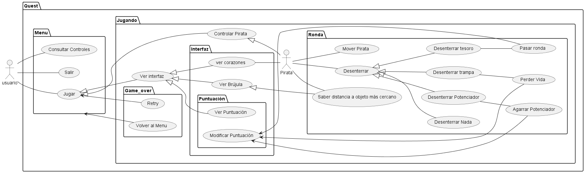

# Proyecto Quest(Juego en pygame)
Quest es un juego que nace como un proyecto final para la materia de Programación Orientada a Objetos (POO) en la Universidad Distrital Francisco José de Caldas. Con una ambientación tropical, este es protagonizado por un pirata que ha llegado a una isla llena de tesoros, la avaricia del pirata lo ha llevado a querer hacerse con todos los tesoros de la isla armado solo con una pala y una brújula, sin embargo, quienes enterraron dichos tesoros allí no iban a dejar que cualquiera se llevara sus riquezas, por lo que el pirata se encontrara con distintas trampas que buscaran acabar con él.

## Jugabilidad:
El menú principal muestra tres opciones, siendo estas "Jugar", que permite al usuario iniciar una nueva partida, "Controles", la cual le permite al usuario consultar los controles para jugar, y "Salir", que cierra la pestaña del juego.

Al iniciar una nueva partida, el pirata aparecerá en el mapa con el máximo de sus corazones (Tres corazones), el mapa inicia con tan solo una trampa y un tesoro enterrados en posiciones aleatorias del mapa, la brújula del jugador le mostrará la distancia de él al objeto enterrado más cercano, y este será capaz de desenterrarlo haciendo uso de su pala. Si el jugador desentierra una trampa, este perderá un corazón, pero si por el contrario desentierra el tesoro, este pasará de ronda. Los corazones no se regeneran entre rondas. Por cada ronda superada, el número de trampas enterradas aumentará en uno. Las posiciones de los objetos enterrados se asignan aleatoriamente en cada ronda, lo que significa que no se mantienen entre rondas. A partir de la quinta ronda superada, empezaran a aparecer también potenciadores enterrados que ayudaran al pirata en su supervivencia, tales como una fruta, que le recupera un corazón, o un escudo, que aguanta el impacto de una trampa. Respecto al escudo, solo se puede llevar un escudo a la vez y no se transfiere entre rondas. El número de potenciadores enterrados aumenta en uno cada tres rondas, a partir de la quinta ronda. Ciertas acciones a lo largo de la ronda suman a un puntaje, este puntaje es uno por cada partida, es decir, se mantiene entre rondas. Las acciones que suman puntos se encuentran relacionadas a continuación:
+ Pasar de ronda -> +100 puntos 
+ Agarrar una fruta -> +50 puntos 
+ Agarrar una fruta con la vida al maximo -> +75 puntos
+ Agarrar un escudo -> +50 puntos 
+ Agarrar un escudo con un escudo ya puesto -> +75 puntos 
+ Colisionar con una bomba -> -50 puntos 

Si el pirata pierde sus tres vidas, se activará el Game Over, mostrando su puntaje final, y permitiéndole al usuario volver a jugar, o volver al menú.

## Diagramas:
- Diagrama de casos de uso:

## Colaboradores del proyecto:
+ Samuel Casas Cantor / 20231020038.
+ Luis Felipe Mongui Dimate / 20231020039.
+ Juan Diego Lozano Luna /20231020040.

## Algunos sprites tomados de:
    + https://gvituri.itch.io/ghost-ship